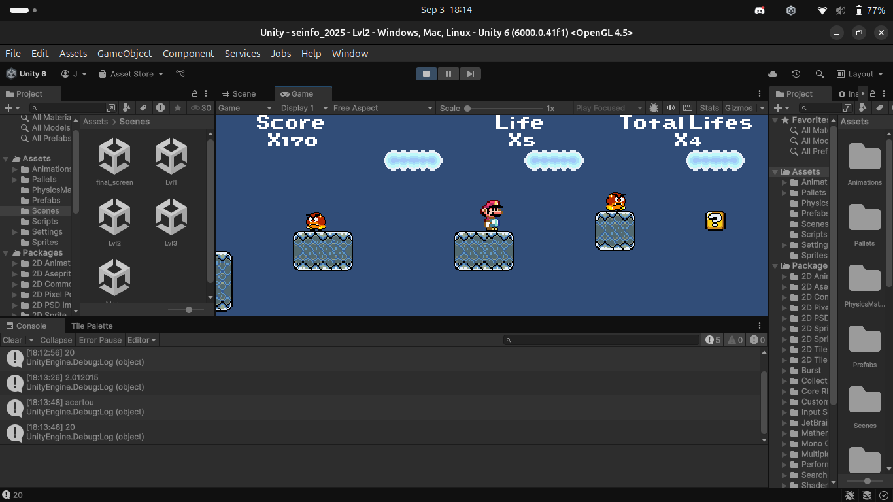
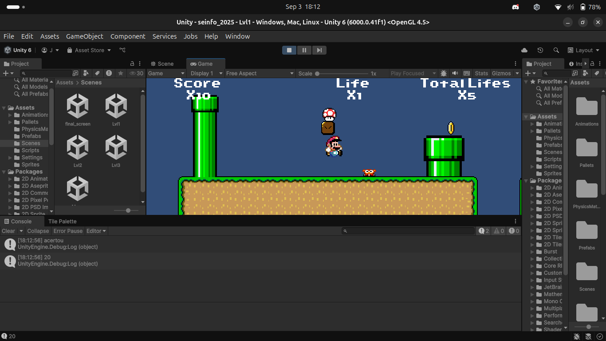
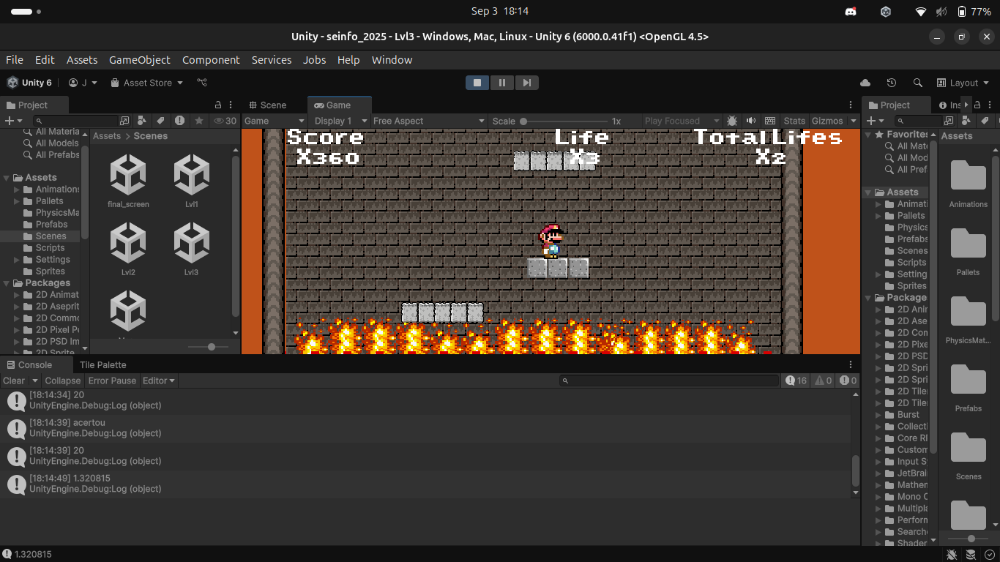

# 🍄 Mario World (Unity)

An educational project inspired by **Super Mario World**, developed in **Unity** with the goal of studying and recreating classic 2D platformer mechanics.  
This project has no official relation with Nintendo or Super Mario.



---

## 🎮 About the Project

This is a **2D platformer game** with smooth movement, simple physics, and a basic enemy.  
The player controls a character that can run, jump on enemies, and go through levels while collecting coins and power-ups.



Main features implemented:
- ✅ Horizontal movement  
- ✅ Jump system (including variable jump height)  
- ✅ Enemy collision (stomp to defeat / take damage when hit)  
- ✅ Coin collection and score increase  
- ✅ Power-ups (e.g., increasing max lives)  
- ✅ Special platforms (e.g., sliding and disappearing)  
- ✅ Automatic generation of the final level  
- ✅ Life management and game over screen  



---

## 🛠️ Technologies Used

- [Unity](https://unity.com/) (version 6000.0.41f1)  
- Language: **C#**  
- Unity 2D Physics system  
- Animations with **Animator**  
- Retro-inspired sprites  

---

## 🚀 How to Run the Project

1. Clone this repository:
   ```bash
   git clone https://github.com/Cast43/seinfo_2025.git
